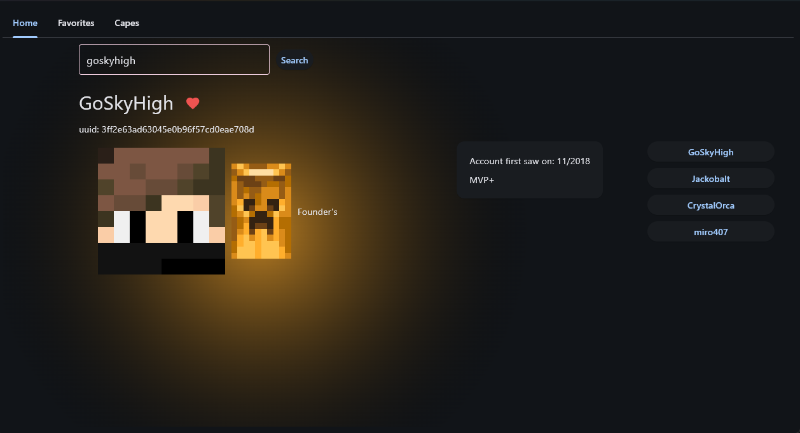

## A Python based, Minecraft and Hypixel API app
- supports search by name or UUID
- a favorites system
- Hypixel integration, showing guildmates, first join date and rank




(a better guide is coming soon)
## How to set up
1. Download all .py files in a new folder
2. Create a .env file with the following content:
```
hypixel_api_key = "46dbc342-ec95-4c53-874f-43b3dec261f76" # SAMPLE API KEY, INSERT YOUR OWN
```
3. get a Hypixel API key from https://developer.hypixel.net/dashboard/apps

